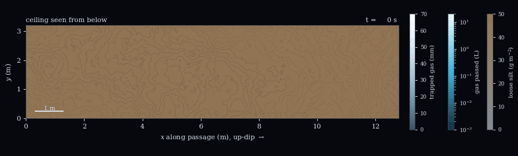
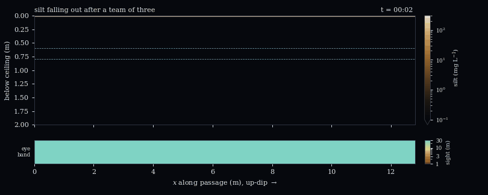
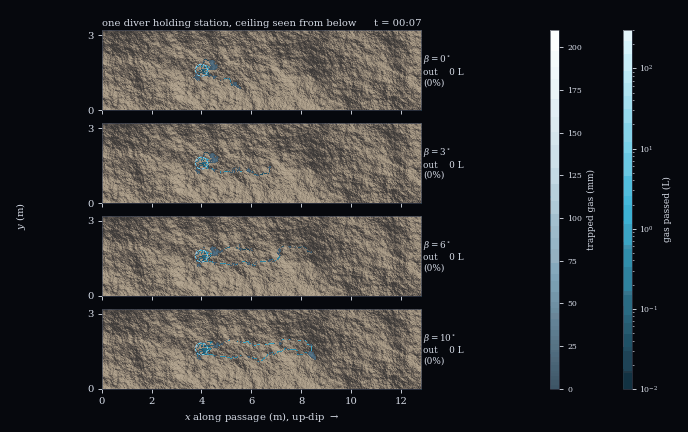
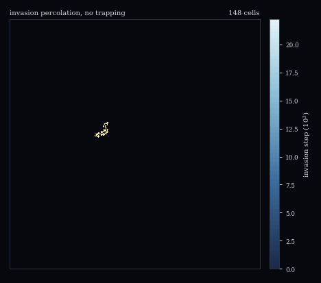

# Supplementary Materials "An Idealized Model of Buoyant Gas Spreading and Silt Release beneath Rough Cave Ceilings"

[](https://www.python.org)
[](https://numpy.org)
[](https://scipy.org)
[](https://peps.python.org/pep-0008/)
[](LICENSE)

Supplementary code for an idealized model of what cave divers call
percolation: exhaled open-circuit gas collecting under a rough ceiling,
spilling up-dip from pocket to pocket, and stripping loose silt that then
rains into the passage. 

**Authors:** Sandy H. S. Herho, Dasapta E. Irawan, Rusmawan Suwarman, Deny J. Puradimaja

<p align="center">
  <br>
  <sub>Looking up: a team of three passes under a silty, 2&deg; dipping ceiling. Silver is trapped gas (mm), cyan the gas volume that has crossed each cell (L), ochre to gray the loose silt left on the rock (g m<sup>-2</sup>); contours mark the relief every 4 cm.</sub>
</p>

<p align="center">
  <br>
  <sub>Side view of the first hour: coarse flakes fall at once, fine silt hangs under the ceiling and reaches eye level over tens of minutes. The strip is the sighting range toward the exit.</sub>
</p>

<table>
  <tr>
    <td align="center"></td>
    <td align="center"></td>
  </tr>
  <tr>
    <td align="center"><sub>One diver holding station for 10 min under the same ceiling at dips of 0, 3, 6 and 10&deg;; gas leaving the section: 0, 0, 55 and 91%</sub></td>
    <td align="center"><sub>The smooth-ceiling limit: invasion percolation without trapping</sub></td>
  </tr>
</table>

## Model

Water is hydrostatic and the gas weightless, so a connected pool has a flat
interface at level $`L`$ and covers every cell whose effective ceiling
$`h_{\rm eff} = h - \ell`$ lies above it, with $`\ell = 2\gamma/(\rho g r)`$
a sub-grid pinning height. Pool volume is

```math
V = a^2 \sum_{i \in \rm pool} \left(h_{{\rm eff},i} - L\right).
```

Gas lowers $`L`$ and admits the highest perimeter cell; a perimeter cell with
a higher neighbor outside the pool is a spill point, from which gas climbs
the steepest-ascent path to the next pool; pools meeting at a saddle merge.
The engine is event driven and exact. A contact line crossing a cell removes
a fraction $`\phi_c`$ of its loose silt, gas traveling along a path removes
$`1 - e^{-v/v_d}`$, and released grains settle as 22 Stokes classes. Sighting
range is the distance at which the beam optical depth reaches 4.8.

## Key results

A self-affine ceiling with rms relief $`S(r) = \sigma_1 r^H`$ and dip
$`\beta`$ has the pool scale

```math
r^* = \left(\frac{\sigma_1}{\tan\beta}\right)^{1/(1-H)},
```

and below it gas fed from one point covers an area $`A \propto V^{2/(2+H)}`$.
The cutoff at $`r^*`$ is soft (a stretched exponential with exponent
$`2(1-H)`$), so on rough ceilings with $`H`$ near 1 pools several times
$`r^*`$ still form.

| reference passage, 12 ceilings | value |
| :-- | :-- |
| silt released by divers 1 to 4 of a team, RMV 20 L/min | 121, 52, 34, 27 g |
| team of four / solo diver | 1.96 (1.8 to 2.0 over all sensitivity cases) |
| lead / second diver | 2.36 (2.2 to 2.8 over all sensitivity cases) |
| doubling RMV to 40 L/min, lead diver | +19 % |
| one diver holding station 10 min, dip 0 / 3 / 10&deg; | 130 / 149 / 63 g in section |
| same, gas leaving the 12.8 m section at 6 / 10&deg; | 47 / 94 % |
| sight toward the exit at eye level after a team of three, 15 / 30 / 60 / 90 min | 28 / 24 / 10.5 / 6.9 m |
| sight in the top 0.1 m under the ceiling, first 45 min | under 1 m |
| saturated ceiling under gas, H = 0.8, dip 6 to 9&deg; | 21 to 14 % |

The lead diver strips most of the ceiling because its gas opens new pockets
and paths that the followers' gas then reuses. Visibility toward the exit is
worst well after the team has passed, when fine silt reaches eye level.
Absolute silt masses scale with the unmeasured inventory $`m_0`$, and
sighting ranges change by an order of magnitude between
$`K = 10^{-6}`$ and $`10^{-4}`$ m$`^2`$/s.

## Verification

| check | result |
| :-- | :-- |
| fill-spill engine vs independent priority flood, 147 456 cells | max abs 0 |
| volume conservation over 20 000 injections | 5.9e-15 |
| paraboloid dome area vs $`2\sqrt{\pi R V}`$, a = 8 to 1 cm | 9.8e-3 to 2.3e-4 |
| smooth-ceiling cluster dimension (exact 91/48 = 1.896) | 1.878 [1.847, 1.907] |
| dipping smooth ceiling finger exponent (exact -4/7 = -0.571) | -0.578 [-0.595, -0.562] |
| point-source area exponent, H = 0.5 (0.800) / 0.8 (0.714) | 0.784 / 0.727, intervals contain both |
| pool volume-area exponent, H = 0.5 (1.25) / 0.8 (1.40) | 1.30 / 1.44, 3 to 4 % high |
| residence time vs exact drift-diffusion, smallest step | +0.4 to +4 %, O(dt^1/2) bias |

Full residuals are in `outputs/reports/verification.txt`.

## Run

```bash
pip install -r requirements.txt
python scripts/run_all.py
```

About twenty minutes on one core. Ensembles cache to `outputs/cache/` and are
skipped on reruns.

## Layout

```
cave_percolation/  scenario, ceiling, fillspill, ip, divers, column,
                  experiments, sketch, plotting, anim, io_utils
scripts/          fig00-fig08, anim01-anim04, make_reports, run_all
outputs/          figures (PDF, 600 dpi PNG), animations (GIF),
                  data (CSV per panel), reports (plain text)
```

## Limitations

The loose silt inventory, detachment constants, pinning radius, ceiling
relief statistics, grain sizes and eddy diffusivity are illustrative; no
measurement on a cave ceiling is known to the authors, and
`outputs/reports/sensitivity.txt` shows which results survive varying them.
Gas is quasi-static with no dissolution; the water column is width-averaged
and ignores fin wash, flocculation and floor resuspension. A closed-circuit
rebreather releases no gas in level swimming and so no silt here. The results
are scaling statements and scenario comparisons, not predictions for a
particular cave. Details are in `outputs/reports/open_items.txt`.
